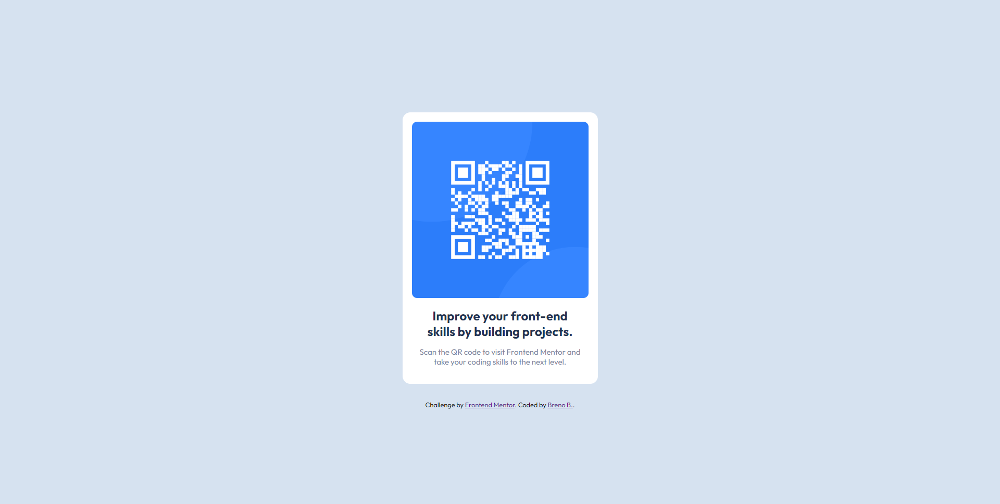

# Frontend Mentor - QR code component solution

This is a solution to the [QR code component challenge on Frontend Mentor](https://www.frontendmentor.io/challenges/qr-code-component-iux_sIO_H). Frontend Mentor challenges help you improve your coding skills by building realistic projects. 

## Table of contents

- [Overview](#overview)
  - [Screenshot](#screenshot)
  - [Links](#links)
- [My process](#my-process)
  - [Built with](#built-with)
  - [What I learned](#what-i-learned)
  - [Continued development](#continued-development)
  - [Useful resources](#useful-resources)
- [Author](#author)
- [Acknowledgments](#acknowledgments)


## Overview

### Screenshot


### Links

- Solution URL: [Add solution URL here](https://your-solution-url.com)
- Live Site URL: [Add live site URL here](https://your-live-site-url.com)

### Built with

- Semantic HTML5 markup
- CSS custom properties
- Flexbox
- Mobile-first workflow

### What I learned
My major learning was the properties of Flexbox. Below, a snippet of CSS code where I used this property.
 
```css
body {
    background: var(--light-gray);
    font-family: 'Outfit', sans-serif;
    min-height: 100vh;
    display: flex;
    flex-direction: column;
    justify-content: center;
    align-items: center;
}
```

### Continued development
I would like to develop myself further in using properties like Flexbox and Grid, as well as improving my logic skills.

### Useful resources
- [A Complete Guide to Flexbox](https://css-tricks.com/snippets/css/a-guide-to-flexbox/) - This guide helped me understand better the Flexbox properties.

## Author
- Frontend Mentor - [@brenobms97](https://www.frontendmentor.io/profile/brenobms97)